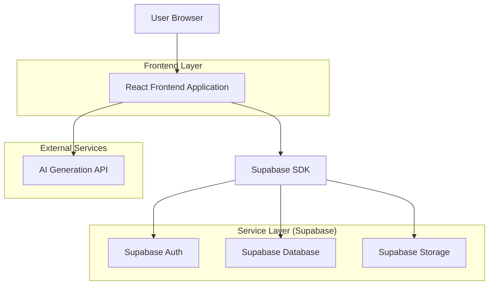
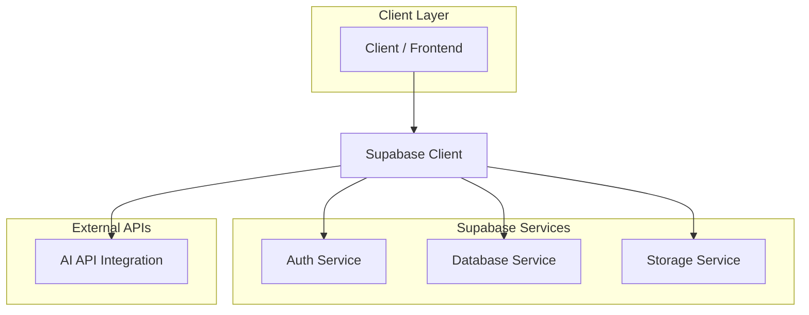
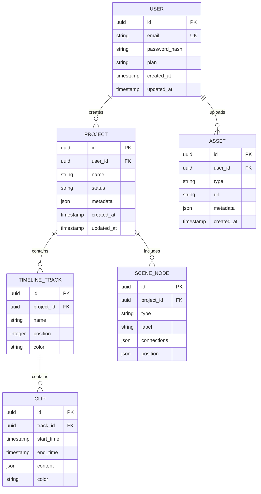

## 1. Architecture design



## 2. Technology Description
- **Frontend**: React@18 + tailwindcss@3 + vite
- **Initialization Tool**: vite-init
- **Backend**: Supabase (Auth, Database, Storage)
- **3D/Animation**: three.js, @react-three/fiber, @react-three/drei
- **State Management**: React Context + useReducer
- **Styling**: Tailwind CSS with custom cyberpunk theme

## 3. Route definitions

| Route | Purpose |
|-------|---------|
| / | Dashboard - Main workspace with generative art tools |
| /video-data | Video Data - Asset management and project gallery |
| /settings | Settings - User preferences and account management |
| /login | Login - User authentication page |
| /register | Register - New user registration page |

## 4. API definitions

### 4.1 Core API

**User Authentication**
```
POST /api/auth/login
```

Request:
| Param Name| Param Type  | isRequired  | Description |
|-----------|-------------|-------------|-------------|
| email     | string      | true        | User email address |
| password  | string      | true        | User password |

Response:
| Param Name| Param Type  | Description |
|-----------|-------------|-------------|
| user      | object      | User profile data |
| session   | object      | Authentication session |

**AI Generation**
```
POST /api/ai/generate
```

Request:
| Param Name| Param Type  | isRequired  | Description |
|-----------|-------------|-------------|-------------|
| prompt    | string      | true        | Generation prompt text |
| style     | string      | false       | Art style preference |
| image     | file        | false       | Reference image file |

Response:
| Param Name| Param Type  | Description |
|-----------|-------------|-------------|
| result_id | string      | Generated artwork ID |
| url       | string      | Generated image URL |
| metadata  | object      | Generation parameters |

## 5. Server architecture diagram



## 6. Data model

### 6.1 Data model definition



### 6.2 Data Definition Language

**Users Table**
```sql
-- create table
CREATE TABLE users (
    id UUID PRIMARY KEY DEFAULT gen_random_uuid(),
    email VARCHAR(255) UNIQUE NOT NULL,
    password_hash VARCHAR(255) NOT NULL,
    plan VARCHAR(20) DEFAULT 'free' CHECK (plan IN ('free', 'premium')),
    created_at TIMESTAMP WITH TIME ZONE DEFAULT NOW(),
    updated_at TIMESTAMP WITH TIME ZONE DEFAULT NOW()
);

-- create index
CREATE INDEX idx_users_email ON users(email);
CREATE INDEX idx_users_plan ON users(plan);
```

**Projects Table**
```sql
-- create table
CREATE TABLE projects (
    id UUID PRIMARY KEY DEFAULT gen_random_uuid(),
    user_id UUID REFERENCES users(id) ON DELETE CASCADE,
    name VARCHAR(255) NOT NULL,
    status VARCHAR(20) DEFAULT 'draft' CHECK (status IN ('draft', 'published', 'archived')),
    metadata JSONB DEFAULT '{}',
    created_at TIMESTAMP WITH TIME ZONE DEFAULT NOW(),
    updated_at TIMESTAMP WITH TIME ZONE DEFAULT NOW()
);

-- create index
CREATE INDEX idx_projects_user_id ON projects(user_id);
CREATE INDEX idx_projects_status ON projects(status);
```

**Assets Table**
```sql
-- create table
CREATE TABLE assets (
    id UUID PRIMARY KEY DEFAULT gen_random_uuid(),
    user_id UUID REFERENCES users(id) ON DELETE CASCADE,
    type VARCHAR(50) NOT NULL,
    url TEXT NOT NULL,
    metadata JSONB DEFAULT '{}',
    created_at TIMESTAMP WITH TIME ZONE DEFAULT NOW()
);

-- create index
CREATE INDEX idx_assets_user_id ON assets(user_id);
CREATE INDEX idx_assets_type ON assets(type);
```

**Supabase Row Level Security Policies**
```sql
-- Grant basic read access to anon role
GRANT SELECT ON users TO anon;
GRANT SELECT ON projects TO anon;
GRANT SELECT ON assets TO anon;

-- Grant full access to authenticated role
GRANT ALL PRIVILEGES ON users TO authenticated;
GRANT ALL PRIVILEGES ON projects TO authenticated;
GRANT ALL PRIVILEGES ON assets TO authenticated;

-- Enable RLS
ALTER TABLE users ENABLE ROW LEVEL SECURITY;
ALTER TABLE projects ENABLE ROW LEVEL SECURITY;
ALTER TABLE assets ENABLE ROW LEVEL SECURITY;

-- Create policies for users
CREATE POLICY "Users can view own profile" ON users FOR SELECT USING (auth.uid() = id);
CREATE POLICY "Users can update own profile" ON users FOR UPDATE USING (auth.uid() = id);

-- Create policies for projects
CREATE POLICY "Users can view own projects" ON projects FOR SELECT USING (auth.uid() = user_id);
CREATE POLICY "Users can create own projects" ON projects FOR INSERT WITH CHECK (auth.uid() = user_id);
CREATE POLICY "Users can update own projects" ON projects FOR UPDATE USING (auth.uid() = user_id);
CREATE POLICY "Users can delete own projects" ON projects FOR DELETE USING (auth.uid() = user_id);
```