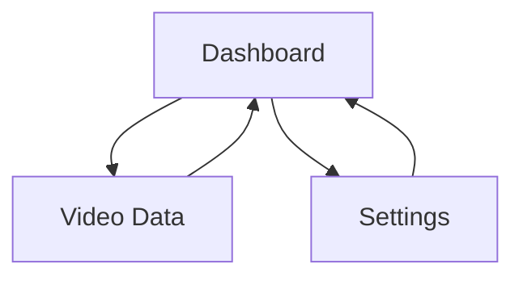

## 1. Product Overview
Imagico is a generative art creation platform with a futuristic cyberpunk interface. Users can create AI-generated artwork through drag-and-drop functionality, visualize scene graphs, and edit timelines with a professional video-editing-style interface.

The product targets digital artists, content creators, and designers who need an intuitive yet powerful tool for AI-assisted creative workflows.

## 2. Core Features

### 2.1 User Roles
| Role | Registration Method | Core Permissions |
|------|---------------------|------------------|
| Free User | Email registration | Basic generative art creation, limited exports |
| Premium User | Subscription upgrade | Unlimited exports, advanced AI models, commercial usage |

### 2.2 Feature Module
Our generative art platform consists of the following main pages:
1. **Dashboard**: Main workspace with drag-drop zone, scene graph visualization, preview panel, and timeline editor.
2. **Video Data**: Asset management and project gallery.
3. **Settings**: User preferences, account management, and application configuration.

### 2.3 Page Details
| Page Name | Module Name | Feature description |
|-----------|-------------|---------------------|
| Dashboard | Header Navigation | Display app logo "Imagico", navigation tabs (Dashboard/Video Data/Settings), user profile dropdown with account controls. |
| Dashboard | Sidebar Tools | Vertical icon toolbar with creative tools, project management, and quick access functions. |
| Dashboard | Drop Zone | Large card area accepting drag-and-drop of images or AI generation requests with prominent "Generative Art" button. |
| Dashboard | Scene Graph | Interactive node visualization showing Character, Environment, Bone Skeleton, Motion, Style, and Video Output connections. |
| Dashboard | Preview Panel | Video preview frame with transport controls (play/pause, seek), progress slider, and time/volume indicators. |
| Dashboard | Timeline Editor | Multi-track timeline with time ruler, playhead, track labels (AI, CC), and colored clip segments with export functionality. |
| Video Data | Asset Gallery | Grid view of generated artworks, video projects, and imported media with search and filter capabilities. |
| Settings | User Profile | Account information, subscription status, usage statistics, and logout functionality. |
| Settings | Preferences | Application themes, default settings, keyboard shortcuts, and export quality options. |

## 3. Core Process
**User Creation Flow:**
1. User lands on Dashboard with prominent drop zone
2. User drags images or clicks "Generative Art" button to initiate creation
3. AI processes request and updates Scene Graph with generated nodes
4. User manipulates timeline tracks to arrange and edit content
5. Preview panel shows real-time updates during editing
6. User exports final artwork via timeline export button

**Navigation Flow:**

## 4. User Interface Design

### 4.1 Design Style
- **Primary Colors**: Deep navy (#0a0a1a) to purple (#1a0a2e) gradient backgrounds
- **Accent Colors**: Neon cyan (#00ffff) and magenta (#ff00ff) for interactive elements
- **Text**: White (#ffffff) for primary content, light gray (#b0b0b0) for secondary
- **Button Style**: Rounded pill shapes with gradient fills and neon glow effects
- **Layout**: Card-based design with dark panels and subtle borders
- **Icons**: Minimalist line icons with faint cyan/purple glows
- **Typography**: Modern sans-serif, clean and readable

### 4.2 Page Design Overview
| Page Name | Module Name | UI Elements |
|-----------|-------------|-------------|
| Dashboard | Header | Dark navy bar with rounded corners, white "Imagigo" logo left, centered tabs with cyan active indicator, user profile pill right |
| Dashboard | Sidebar | Vertical dark panel with stacked circular icon buttons, cyan highlights on hover/active |
| Dashboard | Drop Zone | Large card with dashed border, dark gradient background, centered neon-purple cards placeholder, white instructional text |
| Dashboard | Scene Graph | Dark panel with circular neon badges for nodes, cyan/purple connections, interactive hover states |
| Dashboard | Preview | Small dark video frame, cyan progress slider, white transport icons, subtle glow effects |
| Dashboard | Timeline | Wide dark track area, cyan time ruler, white playhead, colored clip segments (cyan/magenta), export button |

### 4.3 Responsiveness
Desktop-first design approach with mobile-adaptive layouts. Touch interaction optimization for tablet use. Sidebar collapses to icon-only on smaller screens. Timeline and preview panels stack vertically on mobile devices.

### 4.4 3D Scene Guidance
The interface features subtle 3D effects with glassy, translucent panels. Background uses layered gradients with soft vignette glows. Interactive elements have depth through shadows and neon illumination. Card components appear to float with subtle elevation effects.