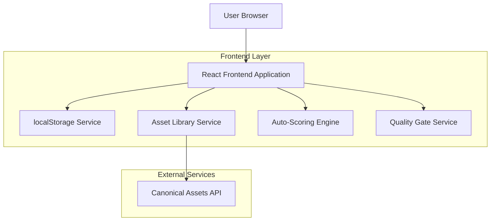
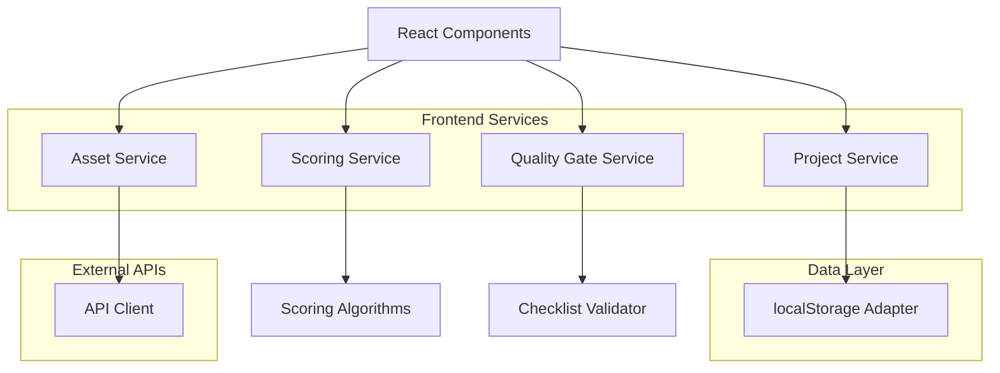
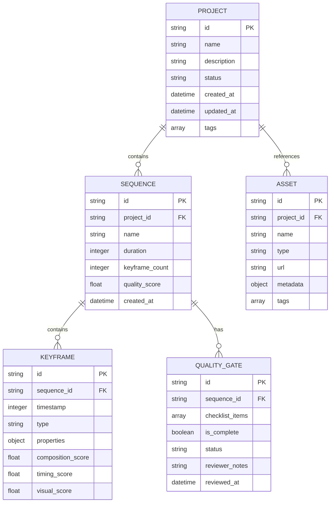

## 1. Architecture design



## 2. Technology Description
- Frontend: React@18 + tailwindcss@3 + vite
- Initialization Tool: vite-init
- Backend: None (client-side only with localStorage persistence)
- External API: Canonical Assets Endpoint

## 3. Route definitions
| Route | Purpose |
|-------|---------|
| / | Projects Dashboard - Main landing page showing all projects |
| /project/:id | Sequence Editor - Edit specific project sequences and keyframes |
| /project/:id/quality | Quality Gate - Validate production readiness checklist |
| /assets | Asset Library - Browse and manage production assets |
| /settings | Application settings and preferences |

## 4. API definitions

### 4.1 Asset Library API Integration
```
GET /api/assets/canonical
```

Request:
| Param Name| Param Type  | isRequired  | Description |
|-----------|-------------|-------------|-------------|
| category  | string      | false       | Filter by asset category (image, video, audio) |
| search    | string      | false       | Search term for asset names |
| page      | number      | false       | Pagination page number (default: 1) |
| limit     | number      | false       | Items per page (default: 50) |

Response:
| Param Name| Param Type  | Description |
|-----------|-------------|-------------|
| assets    | array       | Array of asset objects |
| total     | number      | Total count of assets |
| page      | number      | Current page number |

Example Response:
```json
{
  "assets": [
    {
      "id": "asset-123",
      "name": "Background Music Track",
      "type": "audio",
      "url": "https://assets.example.com/audio/track.mp3",
      "thumbnail": "https://assets.example.com/audio/track-thumb.jpg",
      "metadata": {
        "duration": 180,
        "format": "mp3",
        "size": "4.2MB"
      }
    }
  ],
  "total": 150,
  "page": 1
}
```

## 5. Service Architecture



## 6. Data model

### 6.1 Data model definition


### 6.2 Data Definition Language
Project Table Schema (localStorage JSON structure)
```javascript
// Project object structure
{
  "id": "proj_123456",
  "name": "Summer Campaign 2024",
  "description": "Main promotional video sequence",
  "status": "in_progress",
  "created_at": "2024-12-15T10:00:00Z",
  "updated_at": "2024-12-15T14:30:00Z",
  "tags": ["campaign", "summer", "promo"],
  "sequences": [
    {
      "id": "seq_789012",
      "name": "Opening Sequence",
      "duration": 30000,
      "keyframe_count": 15,
      "quality_score": 85.5,
      "keyframes": [
        {
          "id": "kf_345678",
          "timestamp": 0,
          "type": "title",
          "properties": {
            "text": "Summer Campaign 2024",
            "font_size": 48,
            "color": "#1E3A8A"
          },
          "composition_score": 90,
          "timing_score": 85,
          "visual_score": 88
        }
      ]
    }
  ],
  "assets": [
    {
      "id": "ast_901234",
      "name": "Background Music",
      "type": "audio",
      "url": "https://assets.example.com/audio/bg-music.mp3",
      "metadata": {
        "duration": 180000,
        "format": "mp3",
        "size": 4200000
      },
      "tags": ["background", "music", "upbeat"]
    }
  ],
  "quality_gate": {
    "id": "qg_567890",
    "checklist_items": [
      {
        "id": "item_1",
        "title": "All keyframes have proper timing",
        "completed": true,
        "category": "timing"
      },
      {
        "id": "item_2",
        "title": "Visual consistency maintained",
        "completed": false,
        "category": "visual"
      }
    ],
    "is_complete": false,
    "status": "pending_review",
    "reviewer_notes": "",
    "reviewed_at": null
  }
}
```

## 7. Auto-Scoring Algorithm

### 7.1 Keyframe Scoring Criteria
- **Composition Score (40%)**: Rule of thirds, balance, focal points
- **Timing Score (35%)**: Rhythm, pacing, transition smoothness
- **Visual Score (25%)**: Color harmony, contrast, clarity

### 7.2 Quality Gate Checklist Categories
- **Technical**: Resolution, format compatibility, file integrity
- **Timing**: Keyframe intervals, transition durations, overall pacing
- **Visual**: Color consistency, brand guidelines, accessibility
- **Audio**: Sync accuracy, volume levels, format quality
- **Content**: Text legibility, brand compliance, legal requirements