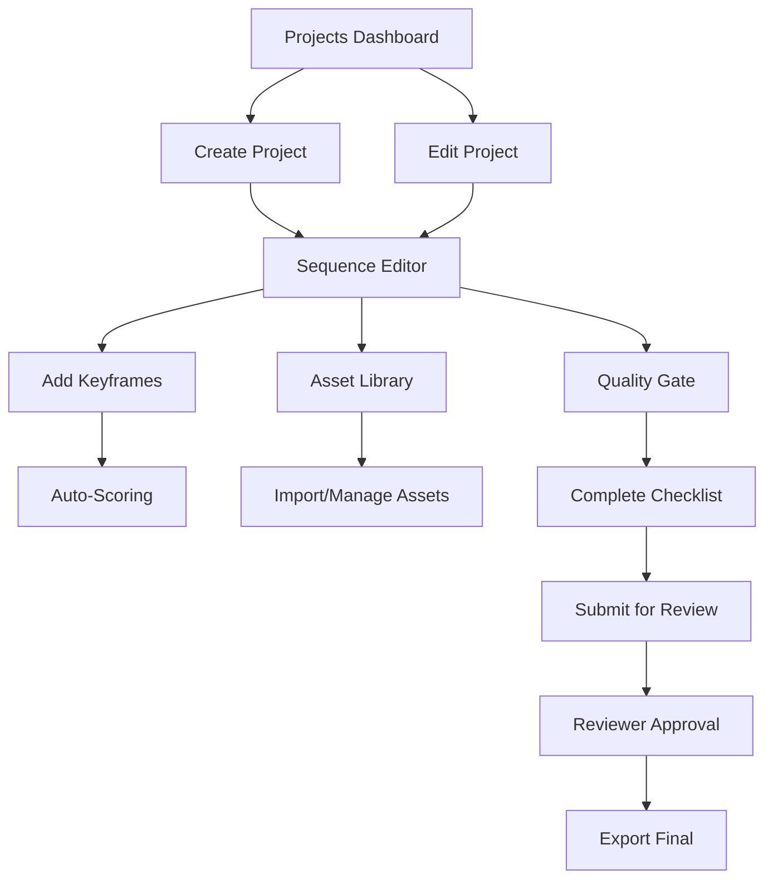

## 1. Product Overview
Production board with lightweight persistence for projects/sequences, asset library management, auto-scoring for keyframes, and quality gate checklist. This enhances the creative workflow by providing project management, asset organization, automated quality assessment, and production readiness validation.

Target users: Content creators, video editors, and production teams who need efficient project management and quality control tools.

## 2. Core Features

### 2.1 User Roles
| Role | Registration Method | Core Permissions |
|------|---------------------|------------------|
| Creator | Email registration | Create/edit projects, access asset library, view scores |
| Reviewer | Invitation-based | View projects, validate quality gates, approve/reject |

### 2.2 Feature Module
Our production board requirements consist of the following main pages:
1. **Projects Dashboard**: Project list, sequence management, quick actions.
2. **Sequence Editor**: Timeline view, keyframe editing, auto-scoring display.
3. **Asset Library**: Asset browser, search/filter, asset details, import/export.
4. **Quality Gate**: Checklist validation, approval workflow, export options.

### 2.3 Page Details
| Page Name | Module Name | Feature description |
|-----------|-------------|---------------------|
| Projects Dashboard | Project List | Display all projects with thumbnails, status indicators, last modified dates. Sort by name, date, status. |
| Projects Dashboard | Project Actions | Create new project, duplicate existing, delete project, export project data. |
| Projects Dashboard | Sequence Overview | Show sequences within each project, sequence duration, keyframe count, quality score. |
| Sequence Editor | Timeline View | Visual timeline with draggable keyframes, zoom controls, playback controls. |
| Sequence Editor | Keyframe Editor | Add/edit/delete keyframes, adjust timing, add transitions, preview changes. |
| Sequence Editor | Auto-Scoring | Real-time quality scoring based on keyframe composition, timing, visual consistency. Display score with color coding. |
| Asset Library | Asset Browser | Grid view of all assets, filter by type (image, video, audio), search by name/tags. |
| Asset Library | Asset Details | Preview asset, view metadata, add/edit tags, download original file. |
| Asset Library | Import/Export | Bulk import assets, export selected assets, sync with canonical assets endpoint. |
| Quality Gate | Checklist Validation | Display production readiness checklist items, mark items as complete/pending, show overall completion percentage. |
| Quality Gate | Approval Workflow | Submit for review, reviewer approval/rejection with comments, track approval status. |
| Quality Gate | Export Options | Export final sequence, generate quality report, package assets for delivery. |

## 3. Core Process
### Creator Flow
1. User creates new project from dashboard
2. User adds sequences and keyframes in sequence editor
3. System automatically scores keyframes in real-time
4. User accesses asset library to add/manage assets
5. User completes quality gate checklist
6. User submits for review when all checklist items complete

### Reviewer Flow
1. Reviewer accesses pending projects from dashboard
2. Reviewer validates quality gate checklist completion
3. Reviewer approves/rejects with comments
4. System updates project status accordingly

## 4. User Interface Design

### 4.1 Design Style
- **Primary Colors**: Deep blue (#1E3A8A) for primary actions, white background
- **Secondary Colors**: Light gray (#F3F4F6) for backgrounds, green (#10B981) for success states
- **Button Style**: Rounded corners (8px radius), subtle shadows, hover effects
- **Font**: Inter font family, 14px base size, clear hierarchy with size variations
- **Layout**: Card-based design with consistent spacing (16px grid system)
- **Icons**: Material Design icons, consistent stroke width (2px)

### 4.2 Page Design Overview
| Page Name | Module Name | UI Elements |
|-----------|-------------|-------------|
| Projects Dashboard | Project Cards | Grid layout with 3 columns on desktop, 1 column on mobile. Each card shows project thumbnail, title, status badge, last modified timestamp. |
| Sequence Editor | Timeline | Horizontal timeline with keyframe markers, current time indicator, zoom slider (10% - 200%). Dark theme for better contrast. |
| Sequence Editor | Scoring Panel | Sidebar panel showing real-time score (0-100), breakdown by criteria, color-coded indicators (red < 60, yellow 60-80, green > 80). |
| Asset Library | Asset Grid | Masonry grid layout, lazy loading for performance, hover overlays with quick actions, infinite scroll for large collections. |
| Quality Gate | Checklist | Vertical list with checkboxes, progress bar at top, item categories with collapsible sections, validation status indicators. |

### 4.3 Responsiveness
Desktop-first design with mobile adaptation. Key breakpoints: 768px (tablet), 1024px (desktop). Touch-optimized controls for mobile devices with larger tap targets (minimum 44px).

### 4.4 Persistence Strategy
LocalStorage-based persistence with automatic save every 30 seconds. Projects stored as JSON with compression for large datasets. Fallback to sessionStorage when localStorage unavailable.