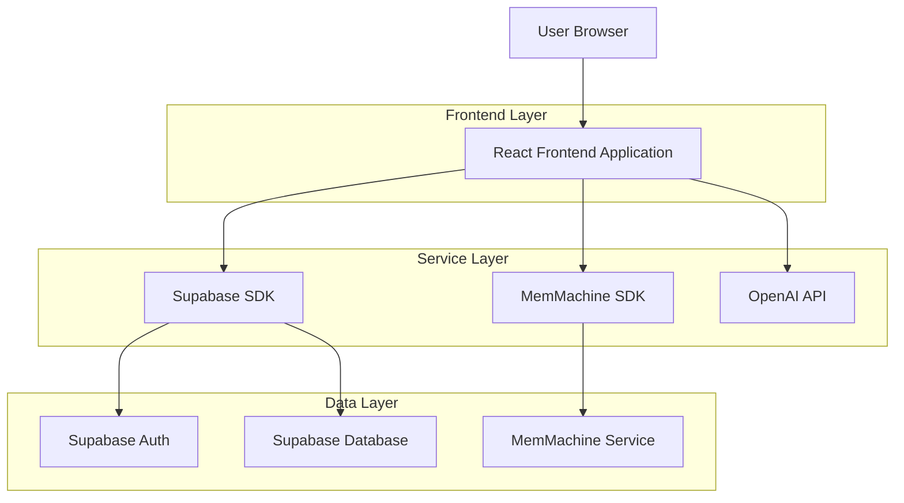
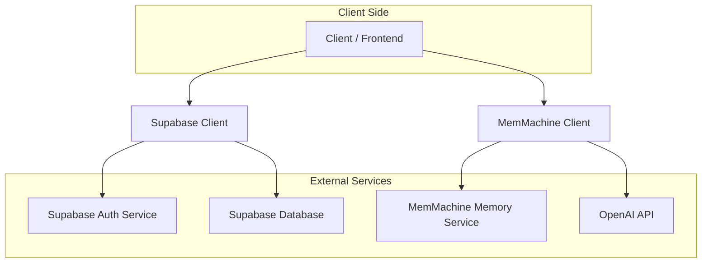
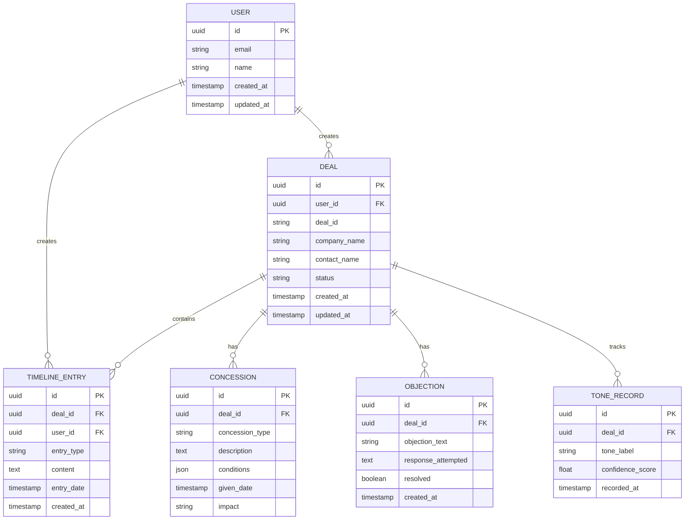

## 1. Architecture design



## 2. Technology Description
- Frontend: React@18 + tailwindcss@3 + vite
- Initialization Tool: vite-init
- Backend: Supabase (Auth + Database)
- AI/ML: OpenAI API for chat completions
- Memory System: MemMachine SDK for persistent episodic memory
- State Management: React Context + localStorage for UI state

## 3. Route definitions
| Route | Purpose |
|-------|---------|
| / | Deals Dashboard - Main landing page with deal list |
| /deals/new | Create Deal - Form to create new negotiation deal |
| /deals/:id | Deal Timeline - Chronological view of all deal activities |
| /deals/:id/chat | Deal Chat - AI assistant interface with memory context |
| /deals/:id/insights | Deal Insights - Memory-backed analysis and reports |
| /login | Login - User authentication page |
| /register | Register - New user registration page |

## 4. API definitions

### 4.1 Authentication APIs
```
POST /auth/v1/token
```
Request (using Supabase auth):
```json
{
  "email": "sales@company.com",
  "password": "securepassword"
}
```

### 4.2 Deal Management APIs
```
GET /rest/v1/deals?user_id=eq.{userId}
POST /rest/v1/deals
PUT /rest/v1/deals?id=eq.{dealId}
```

### 4.3 Timeline APIs
```
GET /rest/v1/timeline_entries?deal_id=eq.{dealId}
POST /rest/v1/timeline_entries
```

### 4.4 Chat APIs (via MemMachine + OpenAI)
```
POST /api/chat
```
Request:
```json
{
  "dealId": "deal-123",
  "message": "What concessions have we made so far?",
  "context": {
    "userId": "user-456",
    "dealHistory": "..."
  }
}
```

## 5. Server architecture diagram



## 6. Data model

### 6.1 Data model definition


### 6.2 Data Definition Language

User Table (users)
```sql
-- create table
CREATE TABLE users (
    id UUID PRIMARY KEY DEFAULT gen_random_uuid(),
    email VARCHAR(255) UNIQUE NOT NULL,
    password_hash VARCHAR(255) NOT NULL,
    name VARCHAR(100) NOT NULL,
    created_at TIMESTAMP WITH TIME ZONE DEFAULT NOW(),
    updated_at TIMESTAMP WITH TIME ZONE DEFAULT NOW()
);

-- grant permissions
GRANT SELECT ON users TO anon;
GRANT ALL PRIVILEGES ON users TO authenticated;
```

Deal Table (deals)
```sql
-- create table
CREATE TABLE deals (
    id UUID PRIMARY KEY DEFAULT gen_random_uuid(),
    user_id UUID REFERENCES users(id) ON DELETE CASCADE,
    deal_id VARCHAR(50) UNIQUE NOT NULL,
    company_name VARCHAR(255) NOT NULL,
    contact_name VARCHAR(255),
    status VARCHAR(20) DEFAULT 'active' CHECK (status IN ('active', 'won', 'lost', 'paused')),
    created_at TIMESTAMP WITH TIME ZONE DEFAULT NOW(),
    updated_at TIMESTAMP WITH TIME ZONE DEFAULT NOW()
);

-- create indexes
CREATE INDEX idx_deals_user_id ON deals(user_id);
CREATE INDEX idx_deals_status ON deals(status);

-- grant permissions
GRANT SELECT ON deals TO anon;
GRANT ALL PRIVILEGES ON deals TO authenticated;
```

Timeline Entries Table (timeline_entries)
```sql
-- create table
CREATE TABLE timeline_entries (
    id UUID PRIMARY KEY DEFAULT gen_random_uuid(),
    deal_id UUID REFERENCES deals(id) ON DELETE CASCADE,
    user_id UUID REFERENCES users(id) ON DELETE CASCADE,
    entry_type VARCHAR(20) CHECK (entry_type IN ('email', 'note', 'call_summary', 'chat_message')),
    content TEXT NOT NULL,
    entry_date TIMESTAMP WITH TIME ZONE DEFAULT NOW(),
    created_at TIMESTAMP WITH TIME ZONE DEFAULT NOW()
);

-- create indexes
CREATE INDEX idx_timeline_deal_id ON timeline_entries(deal_id);
CREATE INDEX idx_timeline_entry_date ON timeline_entries(entry_date DESC);

-- grant permissions
GRANT SELECT ON timeline_entries TO anon;
GRANT ALL PRIVILEGES ON timeline_entries TO authenticated;
```

### 6.3 MemMachine Integration
The application integrates with MemMachine SDK to provide persistent episodic memory:

```javascript
// Memory structure for deal context
interface DealMemory {
  dealId: string;
  episodes: MemoryEpisode[];
  concessions: ConcessionMemory[];
  objections: ObjectionMemory[];
  toneHistory: ToneMemory[];
}

// Memory episode structure
interface MemoryEpisode {
  timestamp: string;
  type: 'concession' | 'objection' | 'tone_change' | 'milestone';
  content: string;
  metadata: {
    importance: number;
    context: Record<string, any>;
  };
}
```

### 6.4 Row Level Security (RLS) Policies
```sql
-- Enable RLS
ALTER TABLE deals ENABLE ROW LEVEL SECURITY;
ALTER TABLE timeline_entries ENABLE ROW LEVEL SECURITY;

-- Create policies
CREATE POLICY "Users can view their own deals" ON deals
    FOR SELECT USING (auth.uid() = user_id);

CREATE POLICY "Users can create their own deals" ON deals
    FOR INSERT WITH CHECK (auth.uid() = user_id);

CREATE POLICY "Users can update their own deals" ON deals
    FOR UPDATE USING (auth.uid() = user_id);

CREATE POLICY "Users can view timeline entries for their deals" ON timeline_entries
    FOR SELECT USING (
        user_id = auth.uid() OR 
        EXISTS (
            SELECT 1 FROM deals 
            WHERE deals.id = timeline_entries.deal_id 
            AND deals.user_id = auth.uid()
        )
    );
```