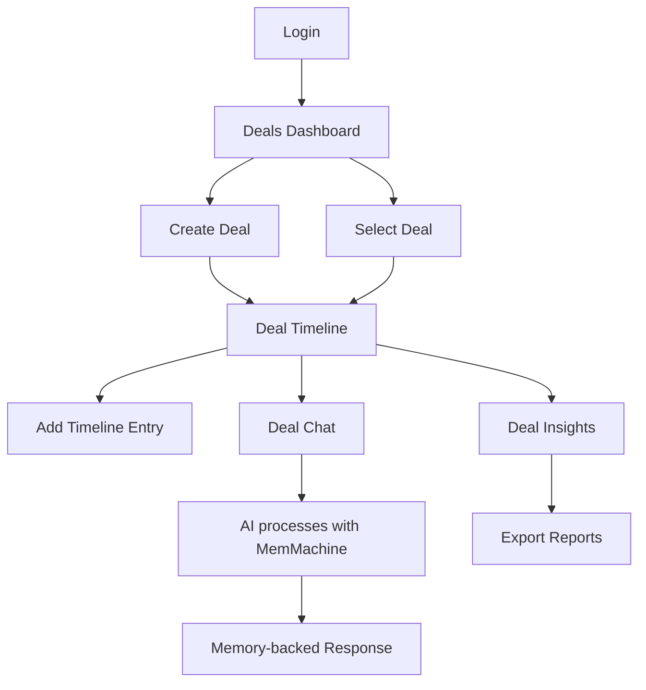

## 1. Product Overview
A web application for sales representatives to manage long-running deal negotiations with AI assistance. The app tracks deal history, conversations, and uses MemMachine's persistent episodic memory to maintain context across weeks/months of negotiations.

Sales reps can create deals, log communications, chat with an AI assistant that remembers all historical context, concessions, objections, and buyer behavior patterns to provide consistent, informed guidance throughout extended negotiation cycles.

## 2. Core Features

### 2.1 User Roles
| Role | Registration Method | Core Permissions |
|------|---------------------|------------------|
| Sales Rep | Email registration | Create/manage deals, view all deal data, chat with assistant |
| Sales Manager | Admin invitation | View team deals, analytics, export data |

### 2.2 Feature Module
The sales negotiation assistant consists of the following main pages:
1. **Deals Dashboard**: List all deals, create new deals, quick stats overview
2. **Deal Timeline**: Chronological view of all notes, emails, call summaries, and chat history
3. **Deal Chat**: AI assistant interface with memory-backed responses
4. **Deal Insights**: Memory-backed outputs including concessions ledger, objections log, and buyer tone analysis

### 2.3 Page Details
| Page Name | Module Name | Feature description |
|-----------|-------------|---------------------|
| Deals Dashboard | Deal List | Display all deals with status, last activity, and key metrics |
| Deals Dashboard | Create Deal | Form to create new deal with Deal ID, company name, contact info |
| Deals Dashboard | Quick Stats | Show total deals, active negotiations, recent concessions |
| Deal Timeline | Timeline View | Chronological display of all notes, emails, call summaries |
| Deal Timeline | Add Entry | Form to paste emails, add notes, or summarize calls |
| Deal Timeline | Search/Filter | Filter timeline by entry type, date range, or keywords |
| Deal Chat | Chat Interface | Real-time chat with AI assistant that has full deal context |
| Deal Chat | Memory Indicators | Show when assistant references historical data |
| Deal Insights | Concessions Ledger | Track what was given, when, and under what conditions |
| Deal Insights | Objections Log | Record buyer objections and what responses worked/failed |
| Deal Insights | Buyer Tone Trend | Simple labels showing tone evolution over time |
| Deal Insights | Export Data | Download insights as formatted reports |

## 3. Core Process
**Sales Rep Flow:**
1. Sales rep logs in and sees deals dashboard
2. Creates new deal or selects existing deal
3. Adds timeline entries (emails, notes, call summaries)
4. Engages with AI assistant in deal chat
5. Reviews memory-backed insights and recommendations
6. Exports reports for internal sharing

**AI Assistant Process:**
1. Receives user message with current deal context
2. Queries MemMachine for relevant historical episodes
3. Analyzes concessions, objections, and tone patterns
4. Generates response informed by entire negotiation history
5. Updates memory with new interaction

## 4. User Interface Design

### 4.1 Design Style
- **Primary Colors**: Professional blue (#2563eb) for primary actions, gray (#6b7280) for secondary
- **Secondary Colors**: Green (#10b981) for success, amber (#f59e0b) for warnings, red (#ef4444) for concessions
- **Button Style**: Rounded corners (8px radius), clear hover states, consistent sizing
- **Font**: Inter for headings, system-ui for body text, 14-16px base size
- **Layout**: Card-based design with clear visual hierarchy, left sidebar navigation
- **Icons**: Heroicons for consistency, emoji sparingly for tone indicators

### 4.2 Page Design Overview
| Page Name | Module Name | UI Elements |
|-----------|-------------|-------------|
| Deals Dashboard | Deal List | Card layout with deal status badges, last activity timestamp, progress indicators |
| Deals Dashboard | Create Deal | Modal form with Deal ID auto-generation, company/contact fields |
| Deal Timeline | Timeline View | Vertical timeline with date separators, entry type icons, expandable content |
| Deal Chat | Chat Interface | Message bubbles with memory indicators, typing indicators, quick action buttons |
| Deal Insights | Concessions Ledger | Table format with date, concession type, conditions, impact assessment |
| Deal Insights | Buyer Tone Trend | Simple line chart with color-coded tone labels (positive/neutral/negative) |

### 4.3 Responsiveness
Desktop-first design with mobile responsiveness. Timeline view collapses to single column on mobile. Chat interface adapts to full-screen on small devices. Key insights remain accessible via swipe navigation on mobile.

### 4.4 Memory Integration
Visual indicators show when AI references historical data: small memory icons next to relevant chat responses, hover tooltips showing "Referenced from [date]", and a memory confidence score for transparency.