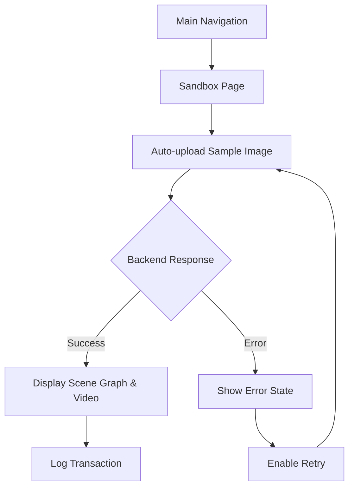

## 1. Product Overview
A development sandbox page that simulates image uploads to test the backend processing pipeline. This tool helps developers verify that image uploads, scene graph generation, and video response functionality work correctly without manual file selection.

## 2. Core Features

### 2.1 User Roles
| Role | Registration Method | Core Permissions |
|------|---------------------|------------------|
| Developer | No registration required | Access sandbox, view logs, test uploads |

### 2.2 Feature Module
Our sandbox requirements consist of the following main page:
1. **Sandbox page**: automatic upload simulation, response display, request logging, error handling.

### 2.3 Page Details
| Page Name | Module Name | Feature description |
|-----------|-------------|---------------------|
| Sandbox page | Auto-upload simulation | Automatically selects and uploads a predefined sample image to the backend API endpoint |
| Sandbox page | Response display | Shows the returned scene graph data and video response in formatted, readable sections |
| Sandbox page | Request logging | Displays timestamped log entries for each upload attempt with status and response details |
| Sandbox page | Error handling | Shows clear error messages and retry options when uploads fail or return invalid responses |
| Sandbox page | Navigation integration | Accessible from main navigation menu with clear "Sandbox" label |

## 3. Core Process
Developer navigates to Sandbox page from main navigation. System automatically initiates upload with sample image. Backend processes image and returns scene graph and video data. Frontend displays results and logs the transaction. If errors occur, system shows error state with retry option.

## 4. User Interface Design

### 4.1 Design Style
- Primary color: Blue (#3B82F6) for primary actions
- Secondary color: Gray (#6B7280) for secondary elements
- Button style: Rounded corners with hover states
- Font: System fonts, 14-16px base size
- Layout: Card-based with clear sections
- Icons: Simple line icons for status indicators

### 4.2 Page Design Overview
| Page Name | Module Name | UI Elements |
|-----------|-------------|-------------|
| Sandbox page | Auto-upload section | Blue "Start Test" button, progress indicator, sample image preview (200x200px) |
| Sandbox page | Response display | Two card sections: Scene Graph (JSON formatter) and Video Response (iframe/embed) |
| Sandbox page | Request logs | Scrollable log panel with timestamp, status badges (green/red), expandable details |
| Sandbox page | Error state | Red alert banner with error message, yellow "Retry" button below |

### 4.3 Responsiveness
Desktop-first design with mobile responsiveness. Touch-friendly buttons and scrollable areas for mobile devices.

### 4.4 Navigation Integration
Sandbox page accessible via main navigation with "Sandbox" menu item. Uses consistent navigation styling with other pages.