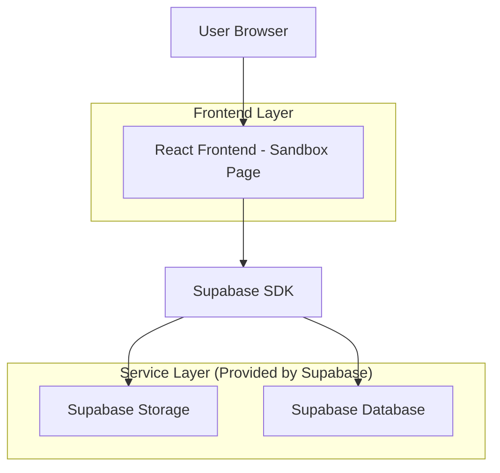
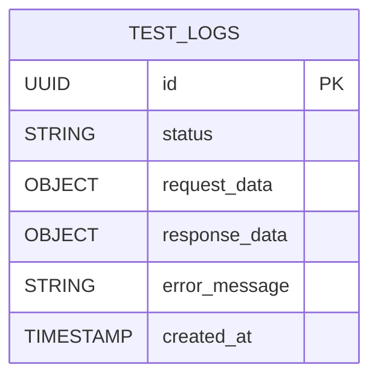

## 1. Architecture design



## 2. Technology Description
- Frontend: React@18 + tailwindcss@3 + vite
- Initialization Tool: vite-init
- Backend: Supabase (Storage + Database)
- Additional Dependencies: lucide-react (icons), date-fns (timestamp formatting)

## 3. Route definitions
| Route | Purpose |
|-------|---------|
| /sandbox | Sandbox test harness page for automatic image upload simulation |

## 4. API definitions

### 4.1 Core API

Image upload and processing
```
POST /api/upload-test
```

Request:
| Param Name| Param Type  | isRequired  | Description |
|-----------|-------------|-------------|-------------|
| image     | File        | true        | Sample image file for testing |
| test_mode | boolean     | true        | Flag indicating sandbox mode |

Response:
| Param Name| Param Type  | Description |
|-----------|-------------|-------------|
| scene_graph | object    | Generated scene graph data |
| video_url   | string    | URL to processed video response |
| status      | string    | Processing status |
| timestamp   | string    | ISO timestamp of response |

Example
```json
{
  "scene_graph": {
    "objects": [{"type": "person", "position": [100, 200]}],
    "relationships": []
  },
  "video_url": "https://example.com/processed-video.mp4",
  "status": "completed",
  "timestamp": "2025-12-14T10:30:00Z"
}
```

## 5. Server architecture diagram
Not applicable - using Supabase services directly from frontend.

## 6. Data model

### 6.1 Data model definition


### 6.2 Data Definition Language
Test Logs Table (test_logs)
```sql
-- create table
CREATE TABLE test_logs (
    id UUID PRIMARY KEY DEFAULT gen_random_uuid(),
    status VARCHAR(20) NOT NULL CHECK (status IN ('pending', 'success', 'error')),
    request_data JSONB,
    response_data JSONB,
    error_message TEXT,
    created_at TIMESTAMP WITH TIME ZONE DEFAULT NOW()
);

-- create index
CREATE INDEX idx_test_logs_created_at ON test_logs(created_at DESC);
CREATE INDEX idx_test_logs_status ON test_logs(status);

-- grant permissions
GRANT SELECT ON test_logs TO anon;
GRANT ALL PRIVILEGES ON test_logs TO authenticated;
```

Sample Logs Storage Bucket (sample-images)
```sql
-- create storage bucket
INSERT INTO storage.buckets (id, name, public, file_size_limit, allowed_mime_types)
VALUES ('sample-images', 'sample-images', true, 5242880, ARRAY['image/jpeg', 'image/png', 'image/webp']);

-- grant permissions
CREATE POLICY "Public access to sample images" ON storage.objects
FOR SELECT USING (bucket_id = 'sample-images');

CREATE POLICY "Authenticated users can upload" ON storage.objects
FOR INSERT WITH CHECK (bucket_id = 'sample-images' AND auth.role() = 'authenticated');
```