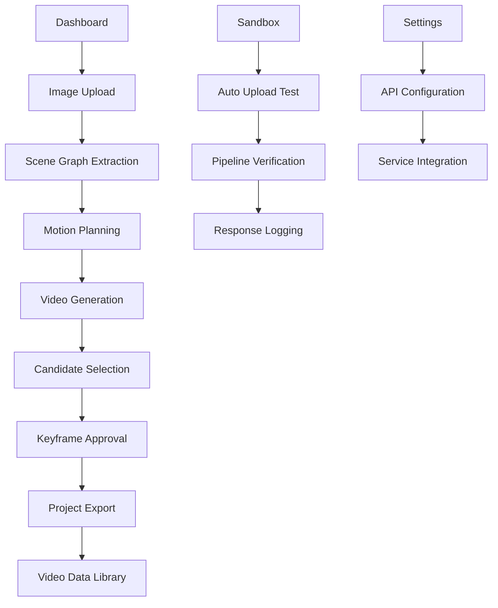

## 1. Product Overview
Sketch Search is an AI-powered image-to-video pipeline application that transforms reference images into storyboarded videos through structured scene analysis. The platform enables creators to upload images, extract scene graphs, plan motion sequences, and generate consistent video outputs using AI-driven workflows.

The application solves the problem of manual video storyboarding by automating scene decomposition, motion planning, and video generation while maintaining visual consistency across shots.

## 2. Core Features

### 2.1 User Roles
| Role | Registration Method | Core Permissions |
|------|---------------------|------------------|
| Creator | Email registration | Upload images, generate videos, manage projects |
| Developer | No registration required | Access sandbox, test pipeline, view system logs |
| Guest | No registration required | Browse demo content, limited uploads |

### 2.2 Feature Module
Our Sketch Search requirements consist of the following main pages:
1. **Dashboard**: Image upload, scene graph extraction, motion planning, video preview.
2. **Video Data**: Project management, video library, export options.
3. **Sandbox**: Development testing, pipeline verification, automated uploads.
4. **Settings**: User preferences, API configuration, system settings.

### 2.3 Page Details
| Page Name | Module Name | Feature description |
|-----------|-------------|---------------------|
| Dashboard | Image Upload | Drag-and-drop interface supporting PNG, JPG, GIF, WebP formats with automatic validation and preview generation. |
| Dashboard | Scene Graph | Interactive visualization of detected objects, relationships, and scene structure with editable JSON interface for manual adjustments. |
| Dashboard | Motion Planning | Configure camera movements, subject animations, background motion, and hard constraints for video generation. |
| Dashboard | Video Preview | Multi-candidate video playback with frame selection, keyframe approval, and canonical frame designation. |
| Dashboard | Timeline Control | Video playback controls, frame navigation, duration adjustment, and shot sequencing. |
| Video Data | Project Library | Grid view of generated video projects with thumbnails, duration, and quick access to view details. |
| Video Data | Export Options | Download videos, share links, and export project data including scene graphs and motion plans. |
| Sandbox | Auto-upload Test | Automated testing with sample images to verify backend pipeline functionality and response validation. |
| Sandbox | Response Logging | Timestamped transaction logs with success/error status, request/response data, and retry mechanisms. |
| Settings | API Configuration | Manage external service keys for Gemini, Qdrant, Freepik Studio integrations with secure storage. |
| Settings | User Preferences | Theme selection, default motion parameters, notification settings, and export preferences. |

## 3. Core Process
Creator uploads image through drag-and-drop interface. System processes image through normalization pipeline. Gemini API extracts scene graph with object detection and relationships. Motion planner generates camera and subject movement sequences. Video generation creates multiple candidate outputs. User reviews candidates, selects keyframes, and approves final version. System stores project data and provides export options.

## 4. User Interface Design

### 4.1 Design Style
- Primary colors: Cyber-dark (#0F172A), Cyber-navy (#1E293B), Cyber-purple (#7C3AED)
- Accent colors: Cyber-cyan (#06B6D4), Cyber-pink (#EC4899), Cyber-magenta (#C026D3)
- Button style: Gradient backgrounds with hover effects, rounded corners, cyber-font typography
- Font: System fonts with cyber-font class for headers, 14-16px base size
- Layout: Card-based with cyber-panel styling, gradient backgrounds, space-themed aesthetics
- Icons: Lucide React icons with cyber color scheme, animated states for loading

### 4.2 Page Design Overview
| Page Name | Module Name | UI Elements |
|-----------|-------------|-------------|
| Dashboard | Upload Area | Gradient cyber-drag-drop zone with Upload icon, hover states, and file type indicators |
| Dashboard | Scene Graph | Interactive node visualization with expandable details, JSON editor with syntax highlighting |
| Dashboard | Motion Controls | Form inputs with duration sliders, constraint checkboxes, and motion type selectors |
| Dashboard | Video Player | Embedded video player with candidate tabs, playback controls, and frame timeline |
| Dashboard | Keyframe Grid | 6-column grid of thumbnail frames with selection rings and approval buttons |
| Video Data | Project Grid | 3-column responsive grid of project cards with gradient placeholders and metadata |
| Sandbox | Test Interface | Blue Start Test button, progress indicators, response cards with formatted JSON |
| Settings | Configuration Forms | Input fields for API keys, toggle switches for preferences, save confirmation |

### 4.3 Responsiveness
Desktop-first design with full mobile responsiveness. Touch-friendly interface with appropriate tap targets, scrollable areas, and adaptive layouts for mobile devices. Grid layouts adjust from 3-column to 1-column on smaller screens.

### 4.4 3D Scene Guidance
The application features cyberpunk-inspired 3D elements with gradient backgrounds creating depth. Environment uses dark themes with neon accent colors. Lighting effects through CSS gradients and shadows. Interactive elements have hover animations and transition effects. No complex 3D scenes required, but visual depth achieved through layered gradients and shadow effects.