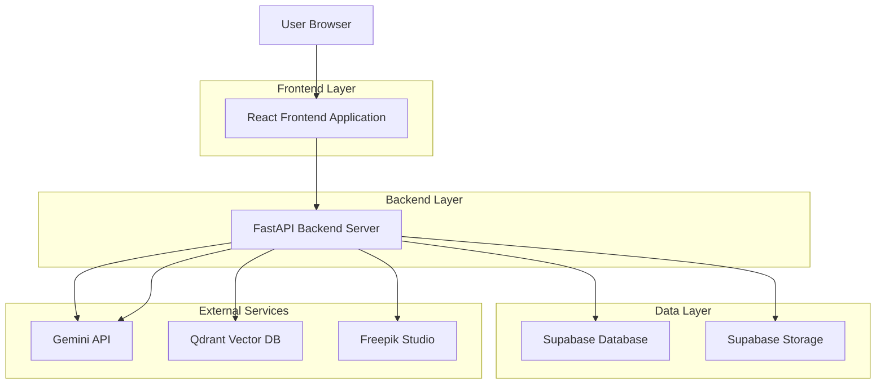
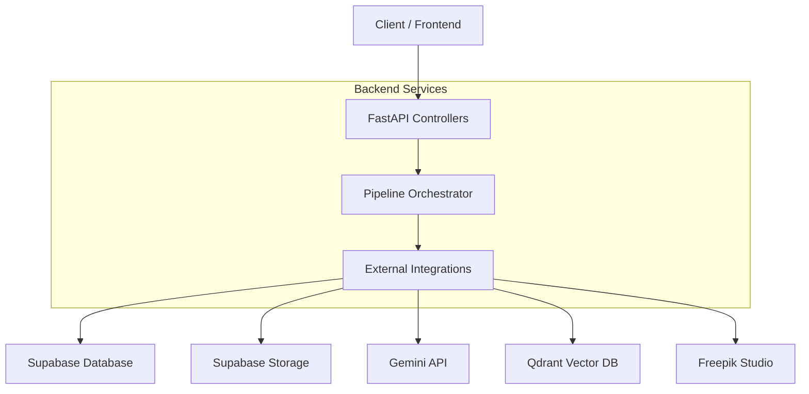
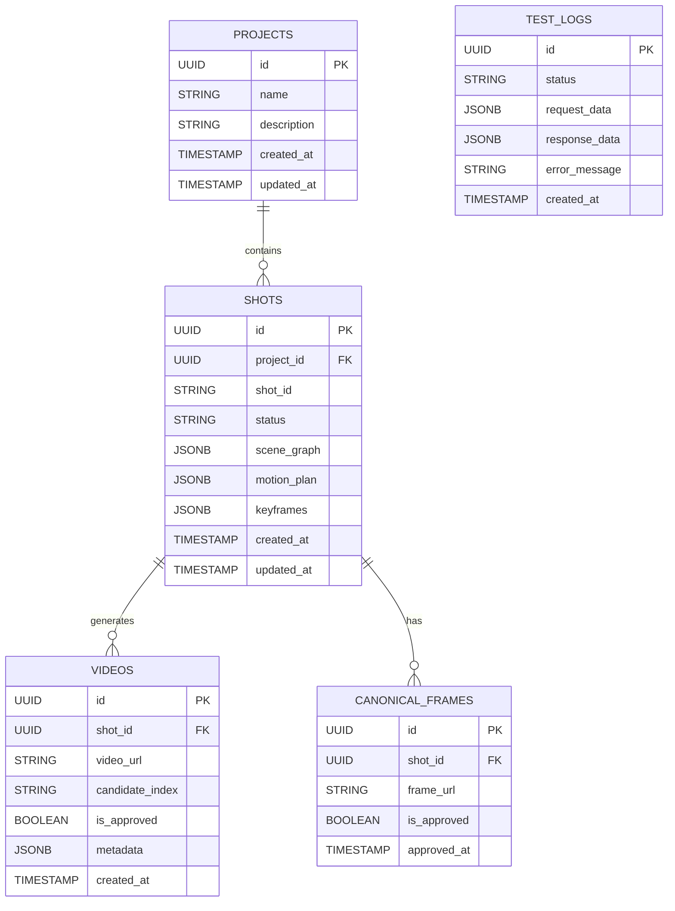

## 1. Architecture design



## 2. Technology Description
- Frontend: React@18 + tailwindcss@3 + vite
- Initialization Tool: vite-init
- Backend: FastAPI (Python)
- Database: Supabase (PostgreSQL)
- Storage: Supabase Storage
- Additional Dependencies: 
  - Frontend: lucide-react, react-dropzone, date-fns
  - Backend: pydantic, python-multipart, qdrant-client

## 3. Route definitions
| Route | Purpose |
|-------|---------|
| / | Dashboard page with image upload and processing pipeline |
| /video-data | Video project library and management |
| /sandbox | Development testing environment |
| /settings | User preferences and API configuration |

## 4. API definitions

### 4.1 Core API

Image upload and processing
```
POST /api/upload
```

Request:
| Param Name| Param Type  | isRequired  | Description |
|-----------|-------------|-------------|-------------|
| file      | File        | true        | Image file for processing |

Response:
| Param Name| Param Type  | Description |
|-----------|-------------|-------------|
| shot_id   | string      | Unique identifier for the shot |
| scene_graph_url | string | URL to generated scene graph JSON |
| motion_plan_url | string | URL to generated motion plan JSON |
| keyframes_url | string   | URL to keyframes directory |
| video_urls | array      | Array of generated video URLs |

Scene graph retrieval
```
GET /api/scene_graph/{shot_id}
POST /api/scene_graph/{shot_id}
```

Motion plan management
```
GET /api/motion_plan/{shot_id}
POST /api/motion_plan/{shot_id}
```

Keyframe operations
```
GET /api/keyframes/{shot_id}
```

Canonical frame approval
```
POST /api/qa/canonical_frame
```

Request:
| Param Name| Param Type  | isRequired  | Description |
|-----------|-------------|-------------|-------------|
| project_id | string     | true        | Project identifier |
| shot_id   | string      | true        | Shot identifier |
| frame_url | string      | true        | URL of approved frame |

Assistant chat endpoint
```
POST /api/assistant
```

## 5. Server architecture diagram



## 6. Data model

### 6.1 Data model definition


### 6.2 Data Definition Language

Projects Table (projects)
```sql
-- create table
CREATE TABLE projects (
    id UUID PRIMARY KEY DEFAULT gen_random_uuid(),
    name VARCHAR(255) NOT NULL,
    description TEXT,
    created_at TIMESTAMP WITH TIME ZONE DEFAULT NOW(),
    updated_at TIMESTAMP WITH TIME ZONE DEFAULT NOW()
);

-- create index
CREATE INDEX idx_projects_created_at ON projects(created_at DESC);
CREATE INDEX idx_projects_name ON projects(name);

-- grant permissions
GRANT SELECT ON projects TO anon;
GRANT ALL PRIVILEGES ON projects TO authenticated;
```

Shots Table (shots)
```sql
-- create table
CREATE TABLE shots (
    id UUID PRIMARY KEY DEFAULT gen_random_uuid(),
    project_id UUID REFERENCES projects(id) ON DELETE CASCADE,
    shot_id VARCHAR(100) UNIQUE NOT NULL,
    status VARCHAR(20) DEFAULT 'pending' CHECK (status IN ('pending', 'processing', 'completed', 'failed')),
    scene_graph JSONB,
    motion_plan JSONB,
    keyframes JSONB,
    created_at TIMESTAMP WITH TIME ZONE DEFAULT NOW(),
    updated_at TIMESTAMP WITH TIME ZONE DEFAULT NOW()
);

-- create index
CREATE INDEX idx_shots_project_id ON shots(project_id);
CREATE INDEX idx_shots_shot_id ON shots(shot_id);
CREATE INDEX idx_shots_status ON shots(status);
CREATE INDEX idx_shots_created_at ON shots(created_at DESC);

-- grant permissions
GRANT SELECT ON shots TO anon;
GRANT ALL PRIVILEGES ON shots TO authenticated;
```

Videos Table (videos)
```sql
-- create table
CREATE TABLE videos (
    id UUID PRIMARY KEY DEFAULT gen_random_uuid(),
    shot_id UUID REFERENCES shots(id) ON DELETE CASCADE,
    video_url TEXT NOT NULL,
    candidate_index INTEGER DEFAULT 1,
    is_approved BOOLEAN DEFAULT false,
    metadata JSONB,
    created_at TIMESTAMP WITH TIME ZONE DEFAULT NOW()
);

-- create index
CREATE INDEX idx_videos_shot_id ON videos(shot_id);
CREATE INDEX idx_videos_candidate_index ON videos(candidate_index);
CREATE INDEX idx_videos_is_approved ON videos(is_approved);

-- grant permissions
GRANT SELECT ON videos TO anon;
GRANT ALL PRIVILEGES ON videos TO authenticated;
```

Canonical Frames Table (canonical_frames)
```sql
-- create table
CREATE TABLE canonical_frames (
    id UUID PRIMARY KEY DEFAULT gen_random_uuid(),
    shot_id UUID REFERENCES shots(id) ON DELETE CASCADE,
    frame_url TEXT NOT NULL,
    is_approved BOOLEAN DEFAULT false,
    approved_at TIMESTAMP WITH TIME ZONE,
    created_at TIMESTAMP WITH TIME ZONE DEFAULT NOW()
);

-- create index
CREATE INDEX idx_canonical_frames_shot_id ON canonical_frames(shot_id);
CREATE INDEX idx_canonical_frames_is_approved ON canonical_frames(is_approved);

-- grant permissions
GRANT SELECT ON canonical_frames TO anon;
GRANT ALL PRIVILEGES ON canonical_frames TO authenticated;
```

Storage Buckets Configuration
```sql
-- create storage buckets
INSERT INTO storage.buckets (id, name, public, file_size_limit, allowed_mime_types)
VALUES 
('project-images', 'project-images', true, 10485760, ARRAY['image/jpeg', 'image/png', 'image/webp', 'image/gif']),
('generated-videos', 'generated-videos', true, 52428800, ARRAY['video/mp4', 'video/webm']),
('keyframes', 'keyframes', true, 5242880, ARRAY['image/jpeg', 'image/png', 'image/webp']);

-- grant permissions for images
CREATE POLICY "Public access to project images" ON storage.objects
FOR SELECT USING (bucket_id = 'project-images');

CREATE POLICY "Authenticated users can upload images" ON storage.objects
FOR INSERT WITH CHECK (bucket_id = 'project-images' AND auth.role() = 'authenticated');

-- grant permissions for videos
CREATE POLICY "Public access to generated videos" ON storage.objects
FOR SELECT USING (bucket_id = 'generated-videos');

CREATE POLICY "Authenticated users can upload videos" ON storage.objects
FOR INSERT WITH CHECK (bucket_id = 'generated-videos' AND auth.role() = 'authenticated');

-- grant permissions for keyframes
CREATE POLICY "Public access to keyframes" ON storage.objects
FOR SELECT USING (bucket_id = 'keyframes');

CREATE POLICY "Authenticated users can upload keyframes" ON storage.objects
FOR INSERT WITH CHECK (bucket_id = 'keyframes' AND auth.role() = 'authenticated');
```